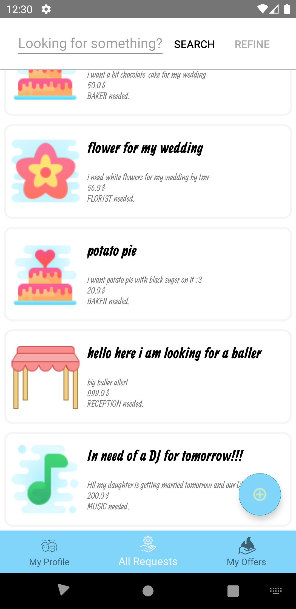

## Scope and Objective of the system 🎯
The goal of this project is to build a wedding planning application in order to simplify the process of plannning your big day. The project will focus on software requirements & documentation. 

SOSWedding is an android application that allows couples to find various types of providers to prepare for their wedding. It offers an all in one package that geatly facilitates their planning process. Providers can bid on each requests and couple can chose the offer that they prefer. Once an oofer is accepted, the deal is done and both parties can interact with each other by emails.

## the initial release include a subset of features of the entire system. Implemented features are the following:
- allow provider and couple to login to the app
- allow couple to post a request
- allow providers to see the requests made by a couple
- allow a provider to bid on a request
- allow a couple to accept/deny an offer taht a provider made on their requests

## Team 👥
| Name          | Github        |
| ------------- |:-------------:|
| Mohanad Arafe | mohanadarafe |
| Christophe Shaka Bahenduzi | csbduzi |
| Hambrsoom Baboyan | hambrsoom |
| Hussain Witwit | hussainwitwit |
| Caren Rizk | carenrizk |
| Alain Job Uzamara Uwe | alainjobs |
| Tarek Ait Hamouda | tarekait1996 |
| Abhijit Gupta | imabhijit |
| Badreddine Loulidi | badred123 |
| Israt Noor Kazi |  |
| John Estrada | john-estrada |

## Technologies 💻
* Java
* Spring
* Android Development tools (Gradle, JUnit, etc...)

## Running the application
### Prerequisites:
- [Android Studio](https://developer.android.com/studio/?gclid=CjwKCAiA_f3uBRAmEiwAzPuaMxg5PgkmsiogvlSd5_FehojyKiAF6KYvjy8YCh-C5vJtFah5n8iKfxoCdbgQAvD_BwE)
- Android Emulator/Physical Android phone
  - An emulator can be downloaded through the AVD Manager of Android studio, OS above Lollipop shoudl be chosen in this case.
## Using the app:
- Clone the repo on your machine
- Open the folder with android studio
- make sure you sync the gradle files, to do this, go in files -> sync projects with gradle files.
 - if a pop up appear, pres Ok.
- select the emulator phone that you would like to use (next to the run button at the top)
- The application should now be running in your emulator/phone

## Quick Tutorial
- Log in by using one of the provided credentials

- Once loged in you have access to your profile page

- You can access your requests via the all requests menu below

- You can click on the + button to create a new requests and post it

- The request is now added to your lists

- By logging as a provider you also have the option to bid on a request

